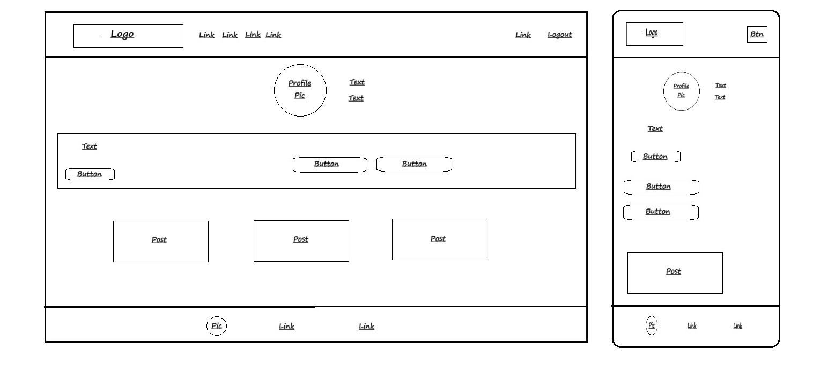
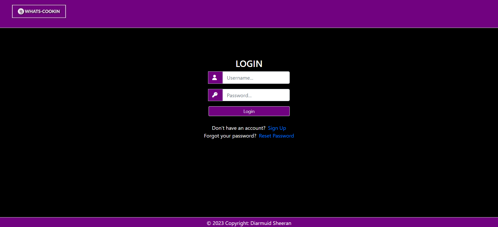
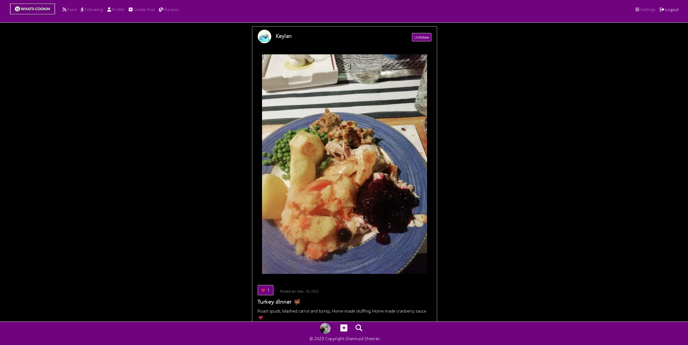
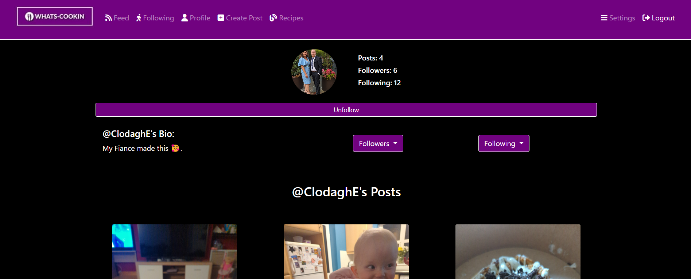
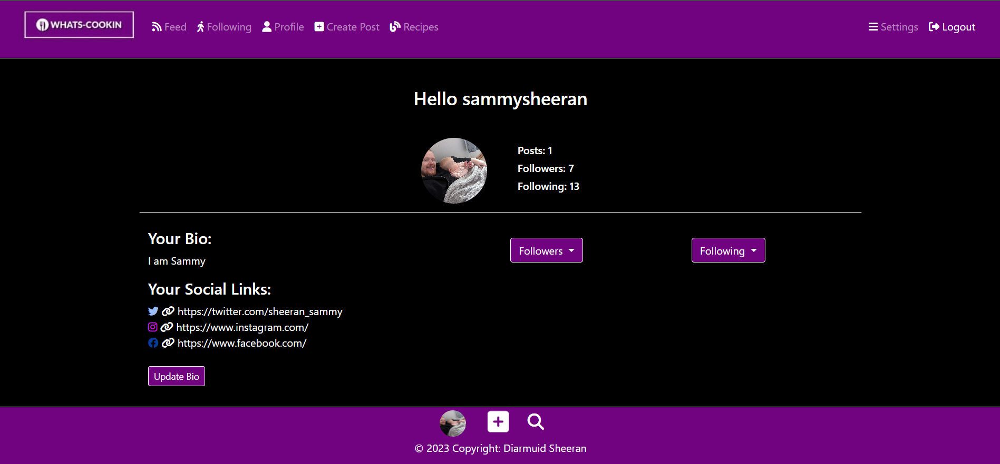
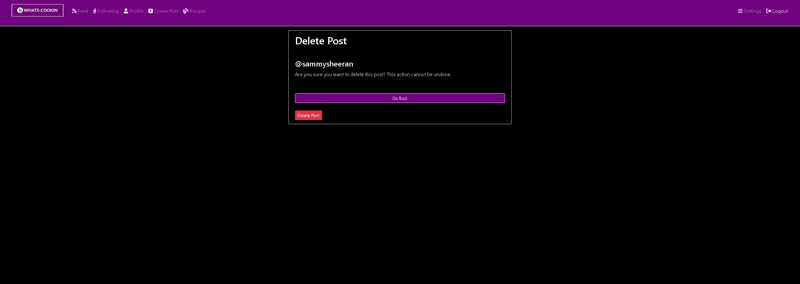

# Whats Cooking Social Site
* Insert Responsive image here
#### Click the link below to view the live site:
* [Whats Cooking Social Site](https://whats-cooking-socail-site-21a4223c5487.herokuapp.com/)
## Site Description :bowl_with_spoon: 
* The goal of Whats Cookin is to be a social media site that puts an emphasis on users to share images of food they have prepared or food they are about to eat. 
* The site allows users to create their own account, sign in and create their own posts to share on the site.
* In addition to this users have their own profile pages and can write a bio of themselves for other users to see.
* The site allows users to interact with posts by liking/unliking them and leaving comments for feedback.
* Users can view other users profiles to check out their posts and bio's.
* Users can view a paginated list of posts on their home page containing all posts posted to the site by all users.
* Users can follow/unfollow users to enhance the user experience of the site. This feature adds the followed users to a custom feed that only shows users that the authenticated user follows.
* The site contains a recipe search that is connected to an api and allows a user to enter a food type for example, eggs, into the search bar and list of recipes that can be made with eggs is displayed to the user.
* The user is given control over their own profile with the abillity to create posts, update posts, delete posts, edit their pesronal info, edit their bio, edit their profile picture, and delete their account.
* The site was created for the Code Institutes PP4 to demonstrate an agile apporach to creating websites and displaying a working knowledge of implementing CRUD functionality to the web application.

## Implementing the Agile Approach
### To ensure an organized and flexible development process for the "Whats Cooking Social Site" project, I have adopted an Agile methodology. Here are the steps I've taken to implement this approach:
* I started by defining the project's scope and objectives. I identified the core functionalities and features that would be essential for the social site.
* Each major feature or functionality was expressed as a user story, written from the perspective of an end-user. For example: "As a site user, I can log in or create an account and log out."
* I converted each user story into a GitHub issue. Each issue includes a clear description of the feature, its tasks, and any relevant details. I assigned labels such as "Must Have" to indicate priority.
* I created a Kanban board with four columns: "To Do," "In Progress," "Done," and "Nice to Have." This board serves as the projects task management indicator.
* This approach ensured I was tackling one user story or set of related issues at a time. This allowed me to deliver working functionality in increments as to not get distracted and finish the targeted task.
* The project could allow  collaboration among team members if needed. Each issue was assigned to me but could be assigned to other team members if the project was a team project.
* As issues are started they are moved to the "In Progress" column, and when they are completed they are moved to the "Done" column.

**By following this Agile approach, I have aimed to deliver a high-quality, user-focused social site to meet user expectations and deliver a compelling online experience.** :grin: 

### The project contains 15 user story issues which can be found here: 
[Link to projects user stories](https://github.com/users/DiarmuidSheeran/projects/5/views/1)
* Please not that due to ammendmants throught the project the id numbers are no longer sequenced.

## Project Design:
### Wireframes
#### With the idea for the website planned, I began with drawing out with a pencil the concept idea for some of the different pages within the site.
* Landing:

* Sign-up:

* Sign-in:

* Home Page:

* Profile Page:

* Reset Password Page:

* Settings Page:

* Update Info Page:

### I then began creating wireframes to depict a more narrowed down outlook for how the differnet pages depending on functionality should look throught the site:

* Landing:

* Form Pages: 

* Feed Pages:

* Search Pages:

* Settings Page:

* Profile Page:

### Colors

* I have incorporated a carefully selected color palette throughout the website, aimed at creating a visually appealing design, allowing for a more streamlined and user-friendly experience.

### Database

* The project relies on a PostgreSQL database hosted on ElephantSQL. Its web interface features a convenient SQL query console. The Database URL, inclusive of the API key, is securely stored as an environment variable within the Heroku platform.

## Site Look and Features

### Landing page:
* **Features**
    * When loading the landing page the user is greeted with the sites tag line and hero image
    * The login and signup buttons are then animated onto the screen from different directions using css styling.
    * The Login button and Sign up button redirects users to the each of the different pages.
    * The Logo in the nav bar is also a link to reload the landing page.

### Sign up page
* **Features**
    * Sign up form is animated in.
    * Input fields have placeholder text inbeded within them to guid users with their inputs
    * A register accounts button redirects users to the the login page where a message is shown where the form has been filled out correctly.
    * If a user dosent fill the form correctly the signup page will be loaded again with error messages detailing what they have failed to enter correctly.
    * Underneath the form a login link can be found that when clicked the user is redirected to the to the login page.

### Log in page
* **Features**
    * Login form is loaded in with placeholder text to guide the user with the information they have to submit to gain access to their account.
    * If the username and passwords dont add up the login page is reloaded with an error message displayed to the user.
    * In the event a user forgets their password a password reset link is displayed under the form which directs the user to the reset password page.
    * If the user dosent have an account their is second link that allows the user to be directed to the signup page.

### Reset password pages
* **Features**
    * The user is greeted with a message and a input field prompting them to enter their email address.
    * When the user enters their email they recieve a message indicating to them that they if the email entered is correct the email has been sent to that address.
    * A gmail account I set up for the project sends an automated email with a link generated by django to the user.
    * Once the user clicks the link they are redirected back to the a password reset page where they can enter a new password.
    * Once the new password is created the user is directed to a success message page with a login button that they can use to direct them to the login page.

### Index/Home page
* **Features**
    * Upon logging in, the user is directed to the index page.
    * At this point the full nav bar and footer is available to the user with links to various pages on the site.
    * On a mobile device the nav bar is condesed down to a dropdown button.
    * The index page contains a paginated list of posts with 5 posts being stored per page to improve the performance of the page.
    * The user can click between first, next, last and previous to navigate through different posts.
    * Each post contains the users posts username, profile picture, the posts image, a like button, the posts title, the posts content, a comment section.
    * In addition to this the post has different properties depending on whether th post is the logged in user or not. The post contains an edit button to edit the post if it is the logged in user or a follower button if it is not. 
    * Within the nav bar the user can choose to log out at anytime and will redirect the user back to the login.
    * To ensure the authenticated user cannot access the landing page and subsequent authentication pages the index page is wrapped within a decorator to ensure the user is redirected back to the index page.

    ### Following page
* **Features**
    * The follow feed acts just as the index page does but is a filltered list of paginated posts tailered to the users that the authenticated user follows.

### Profile page
* **Features**
    * When an authticated user clicks on another users username or profile picture they are directed to that users profile page.
    * From here that users bio can be seen (if no bio entered a general message is applied to the page)
    * The users profile picture is visable along with a count of the amount of posts, followers and people they are following.
    * There is two dropdown buttons that show the users that who they follow or users that follow them. Each of these usersames can be clicked to redirect the user to that specific profile page.
    * All of the posts that the users have posted to the site can be viewed and are clickable links to that posts page.
    * The user can also follow or unfollow other users using the follow buttun underneath the users profile picture.

### Users profile page
* **Features**
    * The Users profile page acts the same as the unathenticated users page with the key difference being that the user has an updtae bio button that directs the users to an update bio page that contains a form that that the user can edit.
    * The follow button is also removed from this page to ensure users dont follow themselves. 
    * Upon successfull edit the user is directed back to their profile where the updated bio can be seen.

### Recipe page
* **Features**

    * An api request is used to gather search results on items of food that the user enter.
    * The request gives the user a list of different recipes that can be made with the entered food. Each item has a title and picture and they are all clickable links to differnet websites that display the recipe.

### User search page
* **Features**
    * When the user clicks the magnifying glass icon they are to the search users page. 
    * The user can enter content into the search bar and are then directed to the search results page.
    * The database is searched for all possible results and a list of viable users shown to the user.
    * Each username is a clickable link and directs the user to that user profile page.

### Create post page
* **Features**
    * The user can create a post either by using the nav bar or by clicking the plus icon in the footer.
    * The plus icon in the footer beats to encourage a user to upload a post.
    * A form is displayed to the user to show with placeholder text to to guide the user in filling out the form corecclty. 
    * There is an upload button that when clicked allows the user to upload a photo to the page.
    * Error handling was implented to ensure the cant enter file sizes that are too large.
    * Once the post is created the user is directed back to the index page with a success message indicating that they have succesfully uploaded their post.

### Edit post page
* **Features**
    * When a user clicks on the edit button at the top of their post they are directed to the posts edit page.
    * A form is displayed to the user with all fields filled with the content currently within them.
    * From here the user can change all aspects of their post or choose to delete it.
    * On succesfull completion of the edit the user is redirected back to the posts page.
    * If the user clicks the delete button they are directed to the delete confirmation page where they can choose to perminantly delete their post.

### Settings page
* **Features**
    * The settings page contains the users profile picture and an option to update their profile picture.
    * It shows the account details of the user with a button that allow the user to update some of this information.
    * When clicked the user is directed to the update info page where a pre filled form is generated that the user can edit.
    * Upon succeddfull editing of the user details they are redirected back to the settings page.
    * Their is also a button to allow the user to delete their account that directs the user to the delete account warning page. From here the user can perminantly delete their account and will be logged out and sent back to the landing page.

### Posts Features
* **Features**
    * Each post has either and edit or follow button explained in the index feature section.
    * If the user is not following another user they will see a button that has text follow in it.
    * Once the user clicks the button the buttons text is changed to following. 
    * The following and follower counts for respective users is then updated.
    * The posts also contains a like button that contains a heart icon and a likes counts.
    * By default the heart icon has no color but once clicked the heart icon's color is changed and the likes count is updated indicating that the user has liked the post.
    * Javascript Ajax using a Json response was used to keep the page in position and to stop the page from refreshing once either of these actions happened.
    * The posts also contain a comments section where users can submit a comment on a specfic post.
    * Once a user submits a comment they are redirected to the posts page to where all comments can be seen.
    * A feature was added that only allowed two comments to be seen at a time as to not clutter the screen.
    * A link to view more is added when there are more than two comments that redirects the user to the posts page.

## Testing
[Link to TESTING.md file](https://github.com/DiarmuidSheeran/whats-cooking-social-site/blob/main/TESTING.md)

## Technolgies Used:
### Languages:
* HTML5
* CSS
* Javascript
* Python

### Frameworks: 
* Django
* Bootstrap

### Other Technolgies: 
* Cloudinary 
* Gitpod
* GitHub 
* Heroku 
* Elephant Sql

## Deployment
1. **Cerate Django app**
* insert info here
2. **Create Heroku app**
* insert info here
3. **Create Database**
* insert info here
4. **Set up Enviorment Variables**
* insert info here
5. **Connect Enviorment Variables to Django app**
* insert info here
6. **Make Migrations**
* insert info here
7. **Create media, static and tmeplate folders**
* insert info here
8. **Create procfile**
* insert info here
9. **Push changes to github**
* insert info here
10. **Heroku Deployment**
* insert info here
11. **Final Deployment**
* insert info here

## Credits

* insert info here

## Acknowledgements

* insert info here

