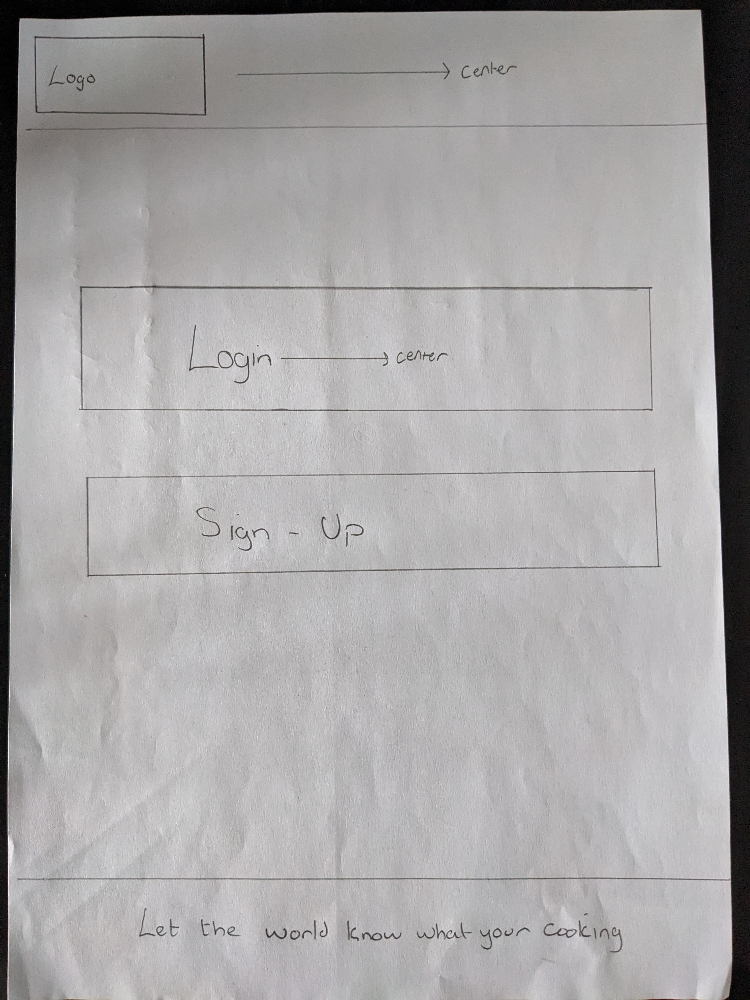

# Whats Cooking Social Site
* Insert Responsive image here
#### Click the link below to view the live site:
* [Whats Cooking Social Site](https://whats-cooking-socail-site-21a4223c5487.herokuapp.com/)
## Site Description :bowl_with_spoon: 
* The goal of Whats Cookin is to be a social media site that puts an emphasis on users to share images of food they have prepared or food they are about to eat. 
* The site allows users to create their own account, sign in and create their own posts to share on the site.
* In addition to this users have their own profile pages and can write a bio of themselves for other users to see.
* The site allows users to interact with posts by liking/unliking them and leaving comments for feedback.
* Users can view other users profiles to check out their posts and bio's.
* Users can view a paginated list of posts on their home page containing all posts posted to the site by all users.
* Users can follow/unfollow users to enhance the user experience of the site. This feature adds the followed users to a custom feed that only shows users that the authenticated user follows.
* The site contains a recipe search that is connected to an api and allows a user to enter a food type for example, eggs, into the search bar and list of recipes that can be made with eggs is displayed to the user.
* The user is given control over their own profile with the abillity to create posts, update posts, delete posts, edit their pesronal info, edit their bio, edit their profile picture, and delete their account.
* The site was created for the Code Institutes PP4 to demonstrate an agile apporach to creating websites and displaying a working knowledge of implementing CRUD functionality to the web application.

## Implementing the Agile Approach
### To ensure an organized and flexible development process for the "Whats Cooking Social Site" project, I have adopted an Agile methodology. Here are the steps I've taken to implement this approach:
* I started by defining the project's scope and objectives. I identified the core functionalities and features that would be essential for the social site.
* Each major feature or functionality was expressed as a user story, written from the perspective of an end-user. For example: "As a site user, I can log in or create an account and log out."
* I converted each user story into a GitHub issue. Each issue includes a clear description of the feature, its tasks, and any relevant details. I assigned labels such as "Must Have" to indicate priority.
* I created a Kanban board with four columns: "To Do," "In Progress," "Done," and "Nice to Have." This board serves as the projects task management indicator.
* This approach ensured I was tackling one user story or set of related issues at a time. This allowed me to deliver working functionality in increments as to not get distracted and finish the targeted task.
* The project could allow  collaboration among team members if needed. Each issue was assigned to me but could be assigned to other team members if the project was a team project.
* As issues are started they are moved to the "In Progress" column, and when they are completed they are moved to the "Done" column.

**By following this Agile approach, I have aimed to deliver a high-quality, user-focused social site to meet user expectations and deliver a compelling online experience.** :grin: 

### The project contains 15 user story issues which can be found here: 
Insert link to user stories here
* Please not that due to ammendmants throught the project the id numbers are no longer sequenced.

## Project Design:
### Wireframes
#### With the idea for the website planned, I began with drawing out with a pencil the concept idea for some of the different pages within the site.
* Landing:

* Sign-up:

* Sign-in:

* Home Page:

* Profile Page:

* Reset Password Page:

* Settings Page:

* Update Info Page:

### I then began creating wireframes to depict a more narrowed down outlook for how the differnet pages depending on functionality should look throught the site:

* Landing:

* Form Pages: 

* Feed Pages:

* Search Pages:

* Settings Page:

* Profile Page:

### Colors

* I have incorporated a carefully selected color palette throughout the website, aimed at creating a visually appealing design, allowing for a more streamlined and user-friendly experience.

insert image of color pallete.

### Data Models

insert image of models plan

### Typography 

* The google font ____ was used throught the site.

## Site Look and Features

### Pages

* **Landing page:**

* **Sign up page**

* **Log in page**

* **Reset password pages**

* **Index/Home page**

* **Following page**

* **Profile page**

* **Users profile page**

* **Edit bio page**

* **Recipe page**

* **User search page**

* **Create post page**

* **Edit post page**

* **Post's page**

* **Settings page**

* **Edit info page**

### Features
* **Signup**

* **Login**

* **Create a post**

* **Edit a post**

* **Like/unlike a post**

* **Comment on a post**

* **Delete a post**

* **Follow/unfollow users**

* **Edit bio**

* **Update user info**

* **Delete account**

## Testing
[Link to TESTING.md file](https://github.com/DiarmuidSheeran/whats-cooking-social-site/blob/main/TESTING.md)

## Technolgies Used:
### Languages:
* HTML5
* CSS
* Javascript
* Python

### Frameworks: 
* Django
* Bootstrap

### Other Technolgies: 
* Cloudinary 
* Gitpod
* GitHub 
* Heroku 
* Elephant Sql

## Deployment
1. **Cerate Django app**
* insert info here
2. **Create Heroku app**
* insert info here
3. **Create Database**
* insert info here
4. **Set up Enviorment Variables**
* insert info here
5. **Connect Enviorment Variables to Django app**
* insert info here
6. **Make Migrations**
* insert info here
7. **Create media, static and tmeplate folders**
* insert info here
8. **Create procfile**
* insert info here
9. **Push changes to github**
* insert info here
10. **Heroku Deployment**
* insert info here
11. **Final Deployment**
* insert info here

## Credits

* insert info here

## Acknowledgements

* insert info here

