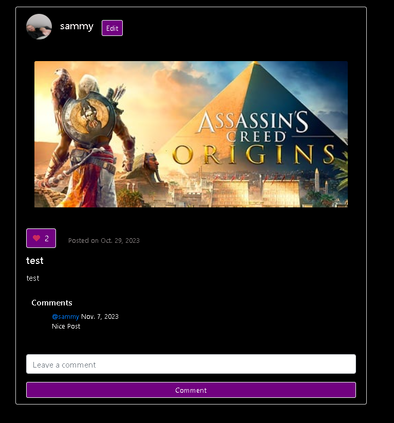

# Manual Testing :man_mechanic:

#### As the developer, I conducted extensive testing along with the invaluable feedback from friends and family to ensure the site's features functioned flawlessly.
#### The project's user stories detailed the features that needed to be tested. Below, you'll find a list of the user stories, the issues they encompassed, and their corresponding grades after testing.

## User Story Issue: User Registration and Authentication
#### Problem Statement: 
* As a site user I can login or create an account and logout so that I can view my content and other users content and choose to logout when finished. 
### Test:
* **Test signup with errors:**

### Result:
* **Pass** :ok_hand:

### Test:
* **Test succesfull signup:**

### Result:
* **Pass** :ok_hand:

### Test:
* **Test login with errors:**

### Result:
* **Pass** :ok_hand:

### Test:
* **Test succesful login:**

### Result:
* **Pass** :ok_hand:

### Test:
* **User Can Logout:**

### Result:
* **Pass** :ok_hand:

## :technologist: Overall Result:
* User can succesfully sign up to create a new account. They can Login to their account and they can logout when needed. Appropriate error messages were displayed to users upon unsuccesfull or incomplete forms being submitted.

## User Story Issue: Create Posts.
#### Problem Statement:
* As a registered user, I can create posts so that I can share my content with the rest of the users on the site.
### Test:
* **Test users can can create posts**

### Result:
* **Pass** :ok_hand:

### Test:
* **Test post creation errors wroking:**

### Result:
* **Pass** :ok_hand:

## :technologist: Overall Result:
* Users can create posts and the posts are correctly placed on users feeds and profiles. Error handling is succesfully used to catch users not entering all details into text fields. File sizes that are too large are prohibeted from being uploaded to the site an error handling succesfully disables users abilities to upload large files.

## User Story Issue: Update Posts
#### Problem Statement: 
* As a registered user, I can update my posts so that I can edit or delete my content.

### Test:
* **Test edit post button directs users to the correct post to edit:**

### Result:
* **Pass** :ok_hand:

### Test:
* **Test updated form fields on post to see if the post updates with new content**

### Result:
* **Pass** :ok_hand:

### Test:
* **Test delete button on post navigates to deletion warning page.**

### Result:
* **Pass** :ok_hand:

### Test:
* **Test delete button on warning page succesfully deletes post.**

### Result:
* **Pass** :ok_hand:

## :technologist: Overall Result:
* The user can succesfully be directed to a post edit page and edit the post they desire. The user can change all fields within the post. The user can choose to delete the post at anytime and is issued with a warning before deleting the post.

## User Story Issue: Like Posts
#### Problem Statement:
* As a registered user, I can like or unlike posts so that I can interact with the content. of the site to enhance my experience.
### Test:
* **Test users can like or unlike posts, check that the like count of the posts changes:**

### Result:
* **Pass** :ok_hand:

## :technologist: Overall Result:
* The user can succesfully click the like button on any post and heve their like recorded. Their count is added and the heart icon changes color. Alternatively the user click the button again to unlike the post and the button's count reverts back along with the icons color.

## User Story Issue: Add Comments to Posts
#### Problem Statement: 
* As a registered user, I can comment on posts so that I can interact with and express my opinion with users about their posts.
### Test:
* **Test users can comment on posts:**

### Result:
* **Pass** :ok_hand:

### Test:
* **Test posts with +2 or more comments have view more link:**

### Result:
* **Pass** :ok_hand:

## :technologist: Overall Result:
* The User can successfully submit comments onto posts. They are succesfully redirected to the posts page. They can only see 2 comments per post on their feeds and can click view more to see all comments on the posts page.

## User Story Issue: Follow other Users & View Follower Counts
#### Problem Statement:
* As a registered user, I can like or unlike posts so that I can interact with the content. of the site to enhance my experience.

* As a registered user, I can view the total number of followers I have and the number of users I'm following so that I can monitor how my profile is doing. 
### Test:
* **Test users can follow or unfollow other users, Check that follower counts are updated on users profile, check user is added to following dropdown menu:**

### Result:
* **Pass** :ok_hand:

## :technologist: Overall Result:
* The user can succesfully click the follow button on a users post and the button will be updated to a unfollow button. The unfollow button can be clicked and the user will unfollow the designated user. The Following count is updated on the users profile page. The followed or not followed user is added or deleted from the users following dropdown menu depending on choice selected.

## User Story Issue: Bio Section
#### Problem Statement:
* As a registered user, I can include a bio section so that I can share some personal details about me.
### Test:
* **Test users can successfully update their accounts bio from their profile page**

### Result:
* **Pass** :ok_hand:

## :technologist: Overall Result:
* The user can succesfully click the bio button on their profile and they are redirected to update bio form page. The User can enter information into whatever fields the wish and click the update bio button. The User is redirected back to the profile page and their bio was succesfully updated.

## User Story Issue: Update or Delete User Information & Update Profile Picture
#### Problem Statement:
* As a registered user, I can edit or delete my profile information so that I can keep my personal information up to date and delete it if necessary.
* As a registered user, I can upload my own profile picture so that I can add personalisation to my profile.
### Test:
* **Test users can successfully update their account information:**

### Result:
* **Pass** :ok_hand:

### Test:
* **Test users can update their profile picture:**

### Result:
* **Pass** :ok_hand:

### Test:
* **Test users can delete their account**

### Result:
* **Pass** :ok_hand:

## :technologist: Overall Result:
* The user can successfully update their account information, update their profile picture and delete their account. All of this can be achieved throught the settings page of the user account.

## User Story Issue: Search Capabilities
#### Problem Statement:
* As a registered user I can search for users within the site so that I can easily find other users on the site.

### Test:
* **Test users abbility to search for other users on the site:**

### Result:
* **Pass** :ok_hand:

## :technologist: Overall Result:
* The user can successfully search for other user profiles within the database.

## User Story Issue: View Recipes
#### Problem Statement:
* As a registered user, I can view recipe ideas by entering food I want to use so that I can get inspiration for new ideas for my content.

### Test:
* **Test users abbility to search for recipes by entering food groups intop search bar**

### Result:
* **Pass** :ok_hand:

## :technologist: Overall Result:
* The user can successfully search for recipes from the seacrh bar by entering a food group. The user can click on the recipe they like and will be directed to the recipes web page.

## User Story Issue:

## User Story Issue:

## User Story Issue:

## User Story Issue:

## User Story Issue:

## User Story Issue:

## User Story Issue:

## User Story Issue:

